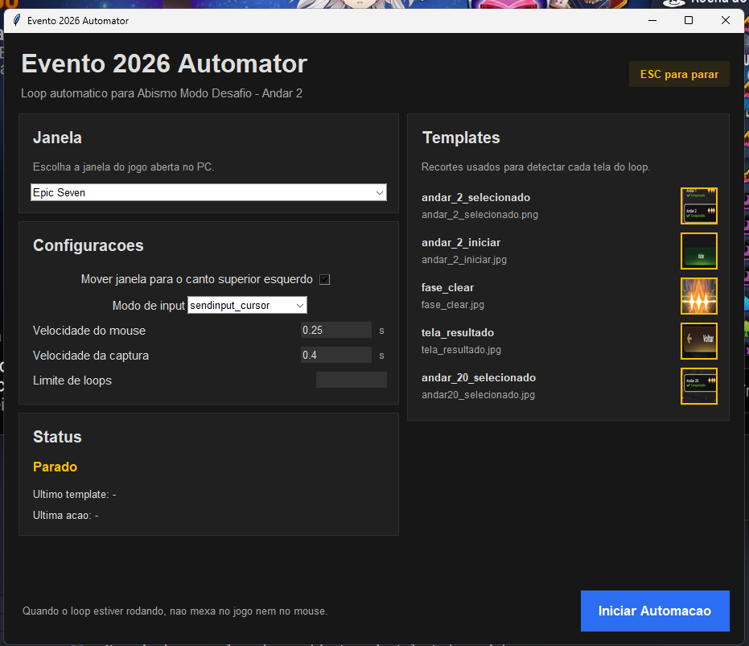

# Evento 2026 Automator Farm do inferno

Bot que repete automaticamente o loop do **Abismo — Modo Desafio — Andar 2** Epic de cada dia.  
Ele detecta as telas do jogo e faz os cliques sozinho. Você só precisa abrir o emulador e iniciar.



---

## Como usar (2 opções)

### Opção 1 — Versão pronta (sem precisar de Python)

1. Vá em **[Releases](../../releases)** e baixe o `.zip` mais recente.
2. Extraia a pasta em qualquer lugar do PC.
3. Abra o arquivo:

```
Abrir Evento 2026 Automator.bat COMO ADMIN SEMPRE
```

Pronto, o app abre direto.

---

### Opção 2 — Pelo código-fonte (precisa de Python)

> Só precisa ter **Python 3.11+** instalado.  
> Se não sabe se tem, abra o Prompt de Comando e digite `python --version`.

1. Clique em **Code → Download ZIP** aqui no GitHub e extraia.
2. Abra o arquivo:

```
Abrir Evento 2026 Automator.bat COMO ADMIN SEMPRE
```

Na primeira vez ele cria o ambiente e instala tudo sozinho.  
Nas próximas vezes abre direto sem esperar.

---

## Antes de iniciar

1. Abra o emulador (BlueStacks, LDPlayer, MuMu ou Google Play Games).
2. Abra o Epic Seven e entre na tela do **Abismo — Modo Desafio**.
3. Deixe o **Andar 2** selecionado.
4. Inicie a automação no app.

> **Dica:** Com o loop rodando, não mexa no mouse nem na janela do jogo.

---

## Como parar

Aperte **ESC** a qualquer momento para interromper a automação.

---

## Ajuste de resolução

O app espera que a janela do emulador tenha **1365 × 768**.  
Se os cliques estiverem errando, confira se o tamanho da janela bate com essa resolução.

---

## Estrutura do projeto

| Arquivo | O que faz |
|---|---|
| `Abrir Evento 2026 Automator.bat` | Launcher de um clique — abre o app |
| `main.py` | Entrada do programa |
| `gui.py` | Interface gráfica (Tkinter) |
| `automation.py` | Motor do loop (detecção de tela + cliques) |
| `app_config.json` | Coordenadas, timings e templates |
| `assets/img/` | Imagens usadas para reconhecer cada tela |
| `requirements.txt` | Dependências Python |

---

## FAQ

**O Windows defender bloqueou o .exe, é vírus?**  
Não. Executáveis gerados com PyInstaller são frequentemente marcados como falso positivo. Você pode conferir todo o código-fonte aqui no repositório.

**Funciona em Mac ou Linux?**  
Não. O app usa APIs do Windows para mover o mouse e detectar janelas.

**Posso mudar o andar ou o modo?**  
O bot está configurado para o Andar 2 do Modo Desafio. Para adaptar, edite o `app_config.json` e troque as imagens em `assets/img/`.

**Que time devo usarrrrr?**  


Lorina - 
Freira do mal - 
Politis - importantissimo o artefato para maior velocidade - 
Mercedes da um auto build ai, mas tenha o EE dela - 
---

## Licença

Projeto pessoal feito por mim, livre para uso. Feito para ajudar a comunidade do Epic Sete durante o evento. 
